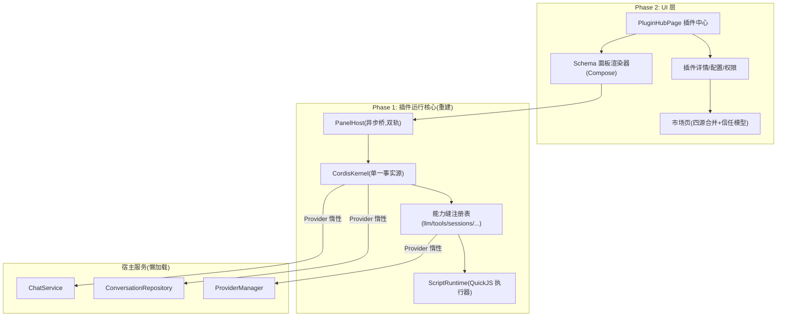

# Design Document: RikkaHub 插件系统深度重构（plugin-system-rebuild）

> 依据：requirements.md（R1-R7，Decisions 1-3，2026-09 调研洞察）。本文档为两期交付的技术设计。

## 1. 架构总览



核心原则：

1. **单一事实源**：插件注册、工具、提示词、Hook 全部收敛到 CordisKernel；ScriptRuntime 降级为被内核调度的执行器（消除双管线）。
2. **懒与隔离**：宿主重依赖（ChatService 全图）全部经 `Provider<T>` 惰性注入插件子系统，组合期零解析。
3. **异步优先**：JS 桥全部异步化，事件由拉模型改推送模型。
4. **护栏渲染**：Schema 面板只能使用宿主预注册的类型化组件目录。

## 2. Phase 1 设计（崩溃根治 + 能力接线 + 面板现代化）

### D1.1 崩溃根治（R1）

**改动点 1：WebViewPage 依赖懒加载**

- `WebViewPage.kt:52-95`：三个 `koinInject`（PluginManager/ScriptRuntime/CordisPluginBridge）全部移出无条件组合路径。
- `pluginId` 为空 → 零插件依赖解析（普通网页/Markdown 预览不再触碰插件链）。
- `pluginId` 非空 → 经 `remember(pluginId) { runCatching { ... } }` 解析，失败时 UI 降级为"插件运行环境不可用"占位页，页面本体保持可打开。

**改动点 2：CordisPluginBridge 依赖瘦身（di/RepositoryModule.kt:199-210）**

- 构造参数中 ChatService、ConversationRepository、AgentHost 三个重依赖改为 `Provider<T>`（Koin `getProvider`），构造期零成本，首次真实调用才拉起。
- 前置依赖（CordisKernel、CordisJsExecutor）保留直接注入（均为轻量构造，已核实）。

**改动点 3：构造副作用清理**

- `CordisHostEventBus`（CordisHostEventBus.kt:36-42）：构造期 launch 常驻协程移到显式 `start()`，由 PluginSubsystemsScope 管理。
- PluginManager 构造期 `startDirectoryWatch` 保留（FileObserver 轻量），但改为可注入 dispatcher 便于测试。

**改动点 4：异常边界**

- 新建 `PluginBoundary`（data/plugin/）：包装全部插件子系统对外入口，`runCatching` + 结构化错误（sealed PluginSubsystemError），UI 呈现降级态（R1.2）。

### D1.2 能力缝真实接线（R2）

**llm.infer 全参数（R2.1）**

- `CordisJsBridge.llm.infer`（CordisJsBridge.kt:98-112）：签名扩展为 `messages/model/systemPrompt` 透传，删除"恒为空列表"的硬编码。流式返回走 D1.3 事件流。

**tools 缝生产者（R2.2）**

- 新建 `ScriptToolsSeamProducer`：把 ScriptRuntime 已启用的 JS 插件工具（ScriptTool.kt 现有清单逻辑）注册进 `HostToolsSeam` 注册表。
- `HostToolsSeam.notifyChanged` 改为事件驱动（tools/change 发出）。
- ChatService 工具管线消费 tools/change：插件工具从 `run_script_tool` 元工具背后拆出，直接以 `pluginId.toolName` 形态出现在工具列表（R4.4 的数据基础）。

**sessions 缝绑定真实会话（R2.3）**

- `HostSessionsSeam.bind` 接入 ConversationRepository（经 Provider），`append/rebuildContext` 落到真实会话表。

**未实现能力可见（R2.4）**

- `CordisKernel.seam()` 返回 null 时，Bridge 返回结构化 `{"ok":false,"reason":"unimplemented"}`；安装期用同一份 `HOST_CAPABILITIES` 清单做预检标记。

### D1.3 面板运行现代化（R3）

**异步调用协议**

- `CordisJsBridge` 新增 `seamCallAsync(seam, method, argsJson)`：立即返回 `callId`，JS 侧经 `CordisBridge.onResult(callId, json)` 回调接收；宿主在 IO 协程执行后用 `evaluateJavascript` 回推。
- 旧 `seamCall` 保留为同步兼容通道（R5 兼容期）。

**事件推送（R3.2）**

- `CordisHostEventBus` 新增 `subscribe(pluginId, handler)`：面板加载时 JS 侧 `CordisEvents.subscribe(topics)`，宿主产生事件时 `evaluateJavascript("CordisEvents.emit(...)")` 主动推送；环形缓冲 + seq 拉取保留为断线恢复手段。

**执行调度**

- `CordisJsExecutor.invoke` 切换到 `Dispatchers.Default`（当前同步阻塞调用线程）。
- `CordisKernel` 的 `@Volatile currentPluginId/currentCapabilities` 改为 `ThreadLocal` 语义（协程局部化：apply 外层 `withContext` + `coroutineContext[PluginScope]`），删除对 `runBlocking` 串行化的依赖（P6）。
- `dispose` 内嵌 `runBlocking` 全部移除，改为结构化并发取消。

### Phase 1 验收映射

| 需求 | 设计项 |
|------|--------|
| R1.1-R1.3 | D1.1 |
| R2.1-R2.4 | D1.2 |
| R3.1-R3.3 | D1.3 |
| R6.1 | D1.3 执行调度 + D1.1 边界 |

## 3. Phase 2 设计（插件中心 + 双轨面板 + 统一 + 信任模型）

### D2.1 插件中心 PluginHubPage（R4.1-R4.3）

- 新页面 `ui/pages/hub/PluginHubPage.kt`：已安装插件卡片流（图标/名称/版本/能力徽章/运行状态/快捷开关），入口落在抽屉（ChatDrawer.kt:559 区域）与设置页（PluginExtensionsCard 指向新页）。
- 插件详情：说明、配置表单（复用 PluginConfigDialog schema 渲染）、权限（能力缝）清单、工具/面板/提示词入口、卸载/更新。
- 面板一键打开：卡片上"打开面板"按钮，直接路由到面板宿主，替代 extensionPoints 兜底发现。

### D2.2 双轨面板宿主（Decision 3）

**manifest 扩展（向后兼容）**

```json
{
  "panel": {
    "type": "schema | web",
    "entry": "panel/index.json",
    "script": "script/logic.js"
  }
}
```

- 缺 `panel.type` 时默认 `web`（存量 PANEL 插件零迁移）。

**Schema 轨（简单面板）**

- 新建 `ui/schema/`：`SchemaPanelRenderer`（Compose）+ 类型化组件目录。首版目录：`Card/Text/Button/Toggle/Slider/Select/List/Grid/Section/Chart/Progress/Markdown`（对齐调研洞察 4 的组件护栏模式，props 全部类型校验，未知组件安全降级为占位）。
- 交互回传：组件事件 → `seamCallAsync('ui', 'onAction', ...)` → 插件 JS 逻辑（QuickJS）→ 返回新 schema → 增量重渲染（key diff）。

**Web 轨（复杂面板）**

- 保留 WebView 渲染，注入宿主设计体系：加载前注入 CSS 变量（Material3 dynamicColorScheme 的 primary/surface/onSurface/圆角/字体），并提供轻量组件样式表 `cordis.css`。
- 桥 = D1.3 异步桥 + 事件推送。

### D2.3 市场信任模型（R7）

- 安装确认页（BottomSheet）：能力缝逐项披露（图标+说明，未实现项标灰）、用途描述、来源、版本与宿主兼容性。
- 安装状态机：`Installing → Installed | Failed(原因)`，失败自动回滚（installZip 已有备份回滚机制，补 UI 呈现）。
- 插件详情证据链：最近更新时间、市场源、兼容性标记。
- 能力预检：安装前用 `HOST_CAPABILITIES` + schema 必填项校验，"已证明可装"才亮安装按钮。

### D2.4 双管线统一（R5）

- ChatService 的 `enabledSystemPrompts`/`dispatchHook`/LocalTools 读取路径全部改读 CordisKernel 状态（kernel 提供 `snapshot()` 冷数据接口，避免 ChatService 依赖插件运行时细节）。
- ScriptRuntime 注册为 kernel 的 JS 执行服务（`ctx.set("jsExecutor", ...)`），Hook/工具执行统一经内核调度。
- 删除平行注册表，`tools/change` 成为唯一工具变更信号。

### Phase 2 验收映射

| 需求 | 设计项 |
|------|--------|
| R4.1-R4.5 | D2.1 + D2.2 |
| R5 | D2.4 |
| R6.2-R6.3 | D2.4 + 现有 PluginManager 安全校验保留 |
| R7 | D2.3 |

## 4. 关键技术决策

| # | 决策 | 理由 |
|---|------|------|
| 1 | Provider 惰性注入而非拆 ChatService | ChatService 23 参构造图不宜动刀（官方同步冲突面大）；惰性注入一行改动即达成"组合期零解析" |
| 2 | 保留 QuickJS 而非换引擎 | 现有 ScriptRuntime + Tools shim 已可用；换 rhino/quickjs-ng 属收益不明的重写 |
| 3 | seamCallAsync 与 seamCall 并存 | 存量面板兼容（Decision 1 兼容策略）；新协议在文档中标记为唯一推荐 |
| 4 | Schema 轨组件目录首版 12 个 | 对齐调研"组件护栏"模式；宁少勿滥，目录可增量扩展 |
| 5 | 工具从元工具拆出 | R4.4 要求聊天中可见插件名/工具名；`pluginId.toolName` 直出同时保住旧三段式调用协议的兼容解析 |
| 6 | kernel 快照接口 | ChatService 读插件状态免运行时耦合，测试可用假内核 |

## 5. 风险与缓解

| 风险 | 等级 | 缓解 |
|------|------|------|
| 官方上游同步冲突（ChatService/ChatInput 是 cherry-pick 热点） | 高 | Phase 1 全部改动收敛在 data/plugin + data/cordis + di，ChatService 只在 D2.4 末段触碰一次 |
| 无构建验证环境（用户指令：暂不构建） | 高 | 每个设计项保持小步提交；Phase 1 完成后提请用户本机构建一次再进 Phase 2 |
| QuickJS 协程化后线程语义回归 | 中 | ThreadLocal→协程局部化配对单测；旧 runBlocking 路径在兼容开关后保留一版 |
| Schema 渲染器工作量膨胀 | 中 | 首版 12 组件硬边界；Chart 只做折线/柱状 |
| 存量插件行为漂移 | 中 | 四源插件抽样回归 + seamCall 同步通道保留 |

## 6. 交付物清单

- Phase 1：D1.1（4 文件级改动）+ D1.2（3 个新生产者/绑定）+ D1.3（桥协议 + 调度）+ 单测（kernel 拓扑/边界/桥协议）。
- Phase 2：PluginHubPage + 详情页 + SchemaPanelRenderer + 市场确认页 + 管线统一收尾。
- 文档：本目录下 requirements.md（已完成）、design.md（本文档）、tasklist.md（待 implementation-planner 产出）。
